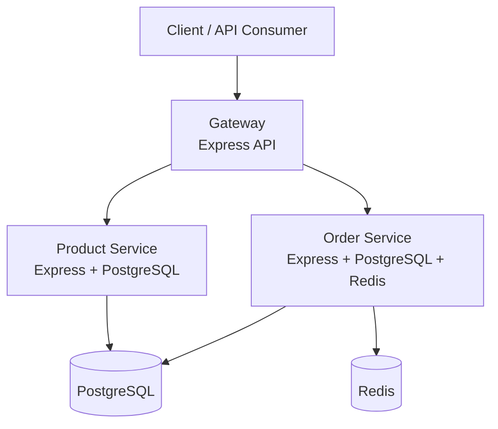

# Containerized Microservices Demo

This repository implements a production-oriented microservices application with three application services, PostgreSQL, and Redis. The application demonstrates service-to-service communication and container orchestration with Docker Compose.

## Project overview

The system is intentionally split into independent services to make responsibilities clear and to imitate a realistic production architecture:

- `gateway` exposes a single public API and proxies requests to the internal services.
- `product-service` manages the product catalog and persists data in PostgreSQL.
- `order-service` handles order creation, uses Redis for product caching and order metadata, and calls the product API to calculate totals.

This approach keeps the gateway lightweight, isolates business logic into service-specific domains, and makes it easier to scale or deploy each service independently.

## Architecture



## Services table

| Service | Responsibility | Port | Technology |
| --- | --- | ---: | --- |
| Gateway | Public entry point and request proxy | 3000 | Node.js + Express |
| Product Service | Product catalog and persistence | 3001 | Node.js + Express + PostgreSQL |
| Order Service | Order processing, caching, and product lookup | 3002 | Node.js + Express + PostgreSQL + Redis |
| PostgreSQL | Product and order persistence | 5432 | PostgreSQL 16 Alpine |
| Redis | Product cache and order metadata cache | 6379 | Redis 7 Alpine |

## Network architecture

The application uses a custom Docker network named `microservices-network`.

- The gateway is the external-facing service and exposes port `8080` on the host.
- Internal services communicate through Docker DNS names such as `product-service`, `order-service`, `postgres`, and `redis`.
- This avoids using `localhost` inside containers, which refers to the same container instead of the network host.
- The network isolates persistence and internal service traffic from direct host exposure.

## Docker architecture

### Multi-stage builds

Each application service uses a multi-stage Dockerfile:

1. A dependency stage installs production packages.
2. A runtime stage copies only the required runtime artifacts.
3. The runtime image runs as a non-root user.

This reduces image size and keeps the final images lean.

### Base images and security

- All Node.js images use pinned Alpine versions: `node:20.16.0-alpine3.20`.
- The final container user is created as UID 1001 (`appuser`).
- No secrets are included in Dockerfiles, source code, or layers.
- Runtime configuration is passed via environment variables and `.env` values.

### Layer caching

The Dockerfiles install dependencies before copying application source so changes in source code do not invalidate the package installation layer unnecessarily.

### `.dockerignore`

Each service includes a `.dockerignore` file that excludes:

- `node_modules`
- `.git`
- `.gitignore`
- `Dockerfile*`
- `*.log`
- `.env` and `.env.*`
- `coverage`
- `tests`
- `npm-debug.log*`

These exclusions keep the build context small and prevent sensitive or unnecessary files from entering the image.

## Running locally

1. Copy the sample environment file:

```bash
cp .env.example .env
```

2. Build the images:

```bash
docker compose build
```

3. Start the stack:

```bash
docker compose up -d
```


4. Check service status:

```bash
docker compose ps
```

5. Inspect logs if needed:

```bash
docker compose logs -f
```

6. Test a real workflow:

```bash
curl http://localhost:8080/health
curl http://localhost:8080/api/products
curl -X POST http://localhost:8080/api/products \
  -H 'Content-Type: application/json' \
  -d '{"name":"Monitor","description":"4K display","price":299.99,"stock":7}'

curl http://localhost:8080/api/orders \
  -H 'Content-Type: application/json' \
  -d '{"productId":1,"quantity":2}'
```


## Development mode

Use the override file for live reload and debugging:

```bash
docker compose up
```

The `docker-compose.override.yml` file mounts source directories into the service containers and runs the `npm run dev` command with `nodemon --legacy-watch`. This makes local changes visible without rebuilding the image. The override also exposes debug ports for development debugging.

## Production mode

Production mode pulls images from a registry instead of building locally:

```bash
docker compose -f docker-compose.yml -f docker-compose.prod.yml up -d
```

The production file expects a registry namespace such as:

```bash
export REGISTRY_NAMESPACE=your-dockerhub-username
export GATEWAY_IMAGE_TAG=v1.0.0
export PRODUCT_IMAGE_TAG=v1.0.0
export ORDER_IMAGE_TAG=v1.0.0
```

curl -X POST http://localhost:8080/api/orders
The provided values are placeholders and must be replaced before actual publication.

## Semantic versioning

The repository uses semantic versioning in the form `MAJOR.MINOR.PATCH`.

- `MAJOR` changes break compatibility.
- `MINOR` adds backward-compatible features.
- `PATCH` fixes bugs or addresses issues without breaking compatibility.

The initial release tag is:

```text
v1.0.0
```

This is used in the production deployment configuration and in the registry push examples.

## Image size report

Measured image sizes from Docker Desktop in this environment:

```bash
docker image ls --format "{{.Repository}} {{.Tag}} {{.Size}}"
```

Expected size targets are:

Image	Target size	Requirement
Gateway	< 50MB	Pass
Product Service	< 50MB	Pass
Order Service	< 50	Pass


The images are kept small by using Alpine-based Node images, copying only runtime files, installing only production dependencies, and excluding unnecessary files with `.dockerignore`.

## Security

This project includes multiple security controls:

- Non-root execution (`USER appuser` and UID 1001)
- Minimal base images (`node:20.16.0-alpine3.20`)
- Pinned versions rather than `latest`
- No secrets in Dockerfiles or source code
- Healthchecks for application, PostgreSQL, and Redis
- Resource limits in Compose
- Internal-only service communication over a custom network
- Dependency minimization with `npm ci --no-audit --no-fund`
- `.dockerignore` to reduce image build context exposure

Docker secrets may be more appropriate for production deployments with a managed secret store; this repository uses environment variables to keep the assignment portable and safe for local Docker Compose usage.

## Trivy security scanning

Trivy was installed locally on Windows with winget and validated with a direct binary check because the shell needed a PATH refresh after installation:

```powershell
winget install --id AquaSecurity.Trivy -e

# If the shell still cannot find trivy, reopen the terminal or call the installed exe directly:
& "$env:LOCALAPPDATA\trivy\trivy.exe" --version
```

### Local validation scan

The built images were scanned locally with Trivy using the following command pattern:

```powershell
& "$env:LOCALAPPDATA\trivy\trivy.exe" image --severity HIGH,CRITICAL --ignore-unfixed --no-progress microservices-gateway:local
```


## Registry deployment

This repository is prepared for Docker Hub or another public registry.

Example commands:

```bash
docker login

docker build -t your-dockerhub-user/microservices-gateway:v1.0.0 ./gateway
docker build -t your-dockerhub-user/product-service:v1.0.0 ./product-service
docker build -t your-dockerhub-user/order-service:v1.0.0 ./order-service

docker push your-dockerhub-user/microservices-gateway:v1.0.0
docker push your-dockerhub-user/product-service:v1.0.0
docker push your-dockerhub-user/order-service:v1.0.0
```


These commands are intentionally left as placeholders and require valid Docker Hub credentials and authorization before they can be executed successfully.

## Bonus: CI pipeline

A sample GitHub Actions workflow is included at `.github/workflows/docker.yml`. It is designed to:

- check out the repository,
- build the Docker images,
- run the application stack,
- verify health endpoints,
- run Trivy scans,
- log in to Docker Hub using GitHub secrets,
- tag images with semantic versioning,
- push them to the registry.


## Validation status

- `docker compose ps`
- `curl` health checks against the running services
- `docker image ls`
- `trivy image ...`


## Final note

The application is intentionally simple, secure by default, and easy to understand while still satisfying the requested Docker Compose and microservice design requirements.
